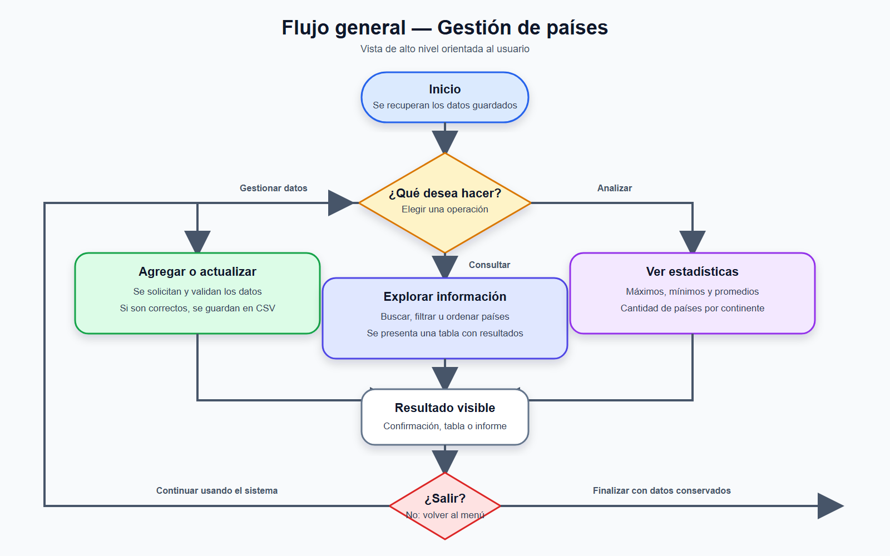

# Sistema de gestión de países

Aplicación de consola desarrollada en Python para administrar información de países. Permite agregar y actualizar registros, realizar búsquedas, aplicar filtros, ordenar los resultados y obtener estadísticas generales. Los datos se conservan en un archivo CSV para que sigan disponibles después de cerrar el programa.

Mantiene una organización modular sencilla. La interfaz, las reglas de negocio, las validaciones, las estadísticas y el acceso al archivo están separados para facilitar la lectura y el mantenimiento.

## Funcionalidades

- Agregar países sin permitir nombres duplicados.
- Actualizar población y superficie.
- Buscar por coincidencia parcial del nombre.
- Filtrar por continente, población o superficie.
- Ordenar por nombre, población o superficie, en ambos sentidos.
- Calcular población máxima y mínima, promedios y cantidad por continente.
- Guardar automáticamente los cambios en `data/paises.csv`.

## Tecnologías y librerías utilizadas

- **Python 3:** lenguaje utilizado para toda la aplicación.
- **`csv`:** biblioteca estándar que permite leer y escribir datos tabulares de forma segura mediante `DictReader` y `DictWriter`.
- **`os`:** biblioteca estándar utilizada para construir rutas, crear la carpeta de datos y verificar la existencia del archivo.

No hace falta instalar dependencias externas.

### ¿Por qué se utilizó CSV?

CSV es una buena opción para este proyecto porque es simple, liviano, legible por personas y compatible con editores de texto y planillas de cálculo. También permite demostrar persistencia sin incorporar una base de datos.

## Patrón utilizado

Se aplicó una versión funcional del **Repository Pattern**. `countries_repository.py` concentra el acceso al CSV y actúa como frontera entre las reglas del programa y el medio de almacenamiento. Gracias a esto, los servicios no necesitan conocer cómo se guardan los datos y una futura migración a otro formato afectaría principalmente al repositorio.

La separación de responsabilidades es la siguiente:

```text
main.py                    Punto de entrada
countries_menu.py          Interacción con el usuario
countries_service.py       Operaciones y reglas de negocio
countries_validations.py   Validación y normalización
countries_stats.py         Cálculos estadísticos
countries_repository.py    Lectura y escritura del CSV
data/paises.csv         Datos persistentes
docs/                      Diagrama y documentación académica
```

El modelo de cada país es un diccionario:

```python
{
    "name": str,
    "continent": str,
    "population": int,
    "area": float,
}
```

## Cómo usar el proyecto

Requisitos: Python 3.10 o una versión posterior.

1. Abrir una terminal en la carpeta del proyecto.
2. Ejecutar:

```bash
python main.py
```

3. Elegir una opción del 1 al 7 y completar los datos solicitados.
4. Para finalizar, seleccionar `7. Salir`.

Los cambios realizados al agregar o actualizar se guardan inmediatamente. El programa valida textos obligatorios, números positivos, rangos y países duplicados; si encuentra un problema, muestra un mensaje y vuelve al menú.

## Diagram de flujo 



## Documentación y enlaces

- [Documentación académica en PDF](docs/Documentacion_Academica_Gestion_Paises.pdf)
- [Documentación editable en Word](docs/Documentacion_Academica_Gestion_Paises.docx)

## Fuentes de consulta

- [Documentación oficial del módulo `csv`](https://docs.python.org/3/library/csv.html)
- [Documentación oficial del módulo `os`](https://docs.python.org/3/library/os.html)
- [Estructuras de datos en Python](https://docs.python.org/3/tutorial/datastructures.html)
- [Repository, por Muhsin Kılıç](https://medium.com/@kmuhsinn/the-repository-pattern-in-python-write-flexible-testable-code-with-fastapi-examples-aa0105e40776)
